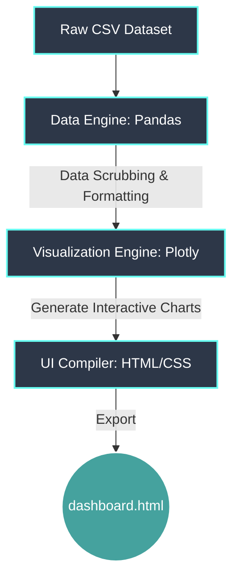

# Week 1: YouTube Analytics Dashboard

This project analyzes the top 1,000 most subscribed YouTube channels, utilizing a defensive data pipeline to clean the dataset and rendering the output into a custom, dark-mode HTML mega-dashboard. 

## System Architecture

